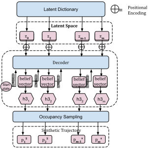

# WildGraph: Realistic Graph-based Trajectory Generation for Wildlife
This repository contains the official implementation of [WildGraph: Realistic Graph-based Trajectory Generation for Wildlife]().
## Train 


## Generate



## Getting Started

1\. Clone this repository:
```
git clone [https://github.com/aliwister/wildgraph.git](https://github.com/aliwister/wildgraph.git)
cd wildgraph
```

2\. Create a conda environment and install the dependencies:
```
conda create --name wildgraph --file requirements.txt
```

## Training

It is quite easy to train and test WildGraph or any of the benchmark methods reported:

<code>python wild_run.py --dataset <geese|stork> --exp <WILDGRAPH|GAN|VAE|WILDGEN|TRANSFORMER> --epochs <epochs> --split_distance <r> --num_exps <number of experiments to average> --desc <a general description> --ablate<uniform_coarse|uniform_fine|no_pe|bow></code>


To train WildGraph:
```
python wild_run.py --dataset geese --exp WILDGRAPH --epochs 90 --split_distance .25


```
To train VAE:
```
python wild_run.py --dataset geese --exp VAE --epochs 90 
```

After training, a report will be saved in `wild_experiments_log/[EXP]` automatically.


## Citation

If you found this repository useful, please consider citing our work:

```
@misc{allawati2024wildgraph,
      title={WildGraph: Realistic Graph-based Trajectory Generation for Wildlife}, 
      author={Ali Al-Lawati and Elsayed Eshra and Prasenjit Mitra},
      year={2024},
      eprint={2404.08068},
      archivePrefix={arXiv},
      primaryClass={cs.LG}
}
```

## License

This repository is licensed under [Apache 2.0](LICENSE).
